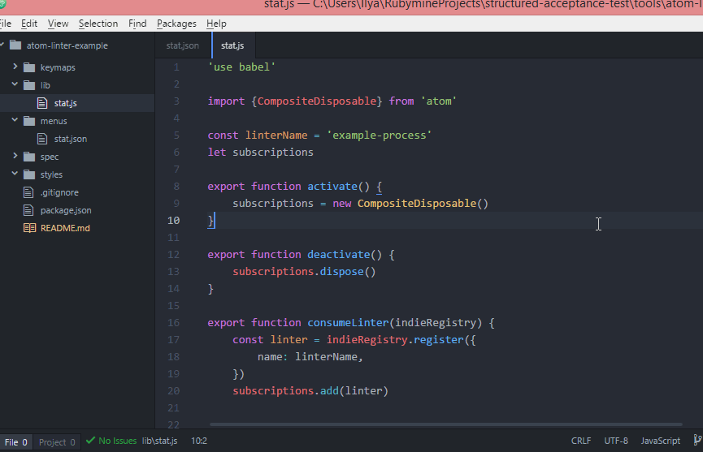

# STAT package
Atom package example for programs compatible with STAT.

In this package we use [example-process](https://github.com/fulldecent/structured-acceptance-test/tree/master/tools/example-process)

To make it works you need to install gem locally:
 ```bash
 gem build example-process.gemspec
 gem install example-process-0.0.1.gem
 ```

 To run package open in Atom and run Package->Stat->Toggle (ctrl+alt+o).

